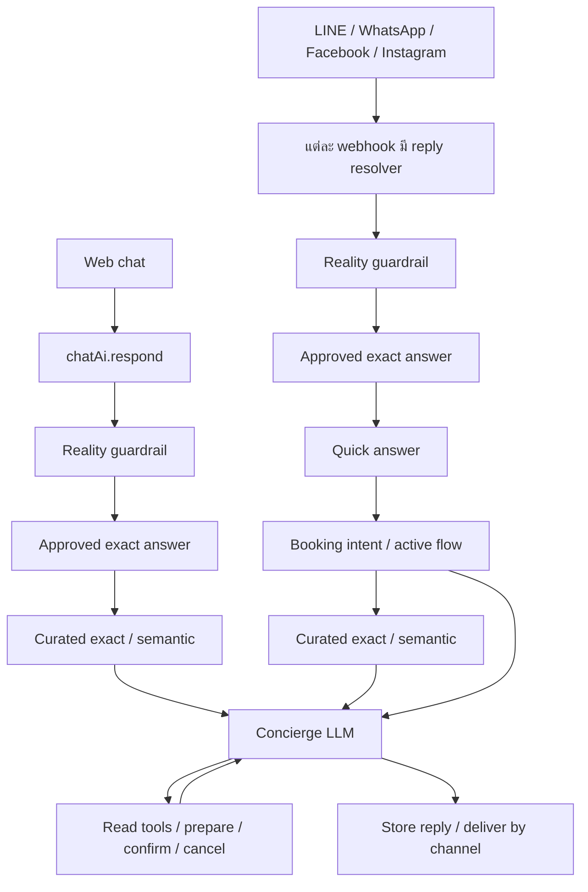
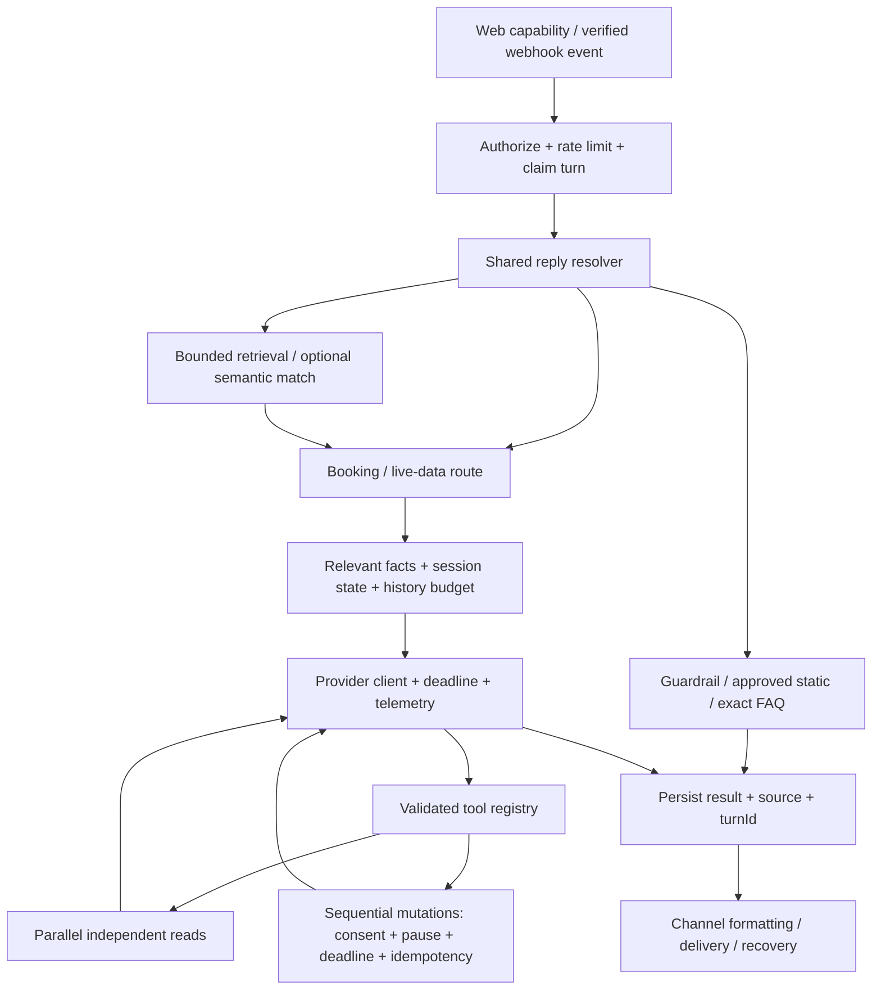

# Audit และแผน optimize AI answer / API / tools

วันที่ตรวจ: 30 กันยายน 2026

ข้อเสนอหลัก: แก้ความถูกต้องของ booking และขอบเขตการเรียก API/tool ก่อน จากนั้นรวม reply pipeline, ลด LLM calls ที่ไม่จำเป็น และเลือก context ตามคำถาม ยังไม่ควรเปลี่ยน provider หรือเพิ่ม vector database ก่อนมี baseline

## ขอบเขตและหลักฐาน

- ตรวจ working tree ปัจจุบัน รวมการแก้ไขที่ยังไม่ commit ใน AI, knowledge และ webhooks; เอกสารนี้เป็นไฟล์เดียวที่เพิ่มจาก audit
- โครงการเป็น Next.js/React + Convex; จุดเข้า AI คือ `chatAi.respond` สำหรับเว็บ และ webhook LINE, WhatsApp, Facebook, Instagram
- Trace อ่าน/เขียนผ่าน `chatSessions`, `chatMessages`, knowledge/questions/scopes, properties/OTA rates, availability/bookings, services/staff/roster/appointments และ rate limits
- อ่าน `AGENTS.md`, `convex/_generated/ai/guidelines.md` และ skill `convex-performance-audit` พร้อม hot-path reference
- `pnpm exec convex insights --details`: deployment `optimistic-turtle-573` ไม่พบ issues ใน 72 ชั่วโมงล่าสุด เป็น deployment ที่ CLI เลือกจาก environment ปัจจุบัน ไม่ใช่การยืนยัน production ทั้งหมด
- `pnpm test:unit`: 68 test files, 502 tests ผ่าน; `pnpm typecheck` และ `pnpm lint` ผ่าน
- เครื่องตรวจใช้ Node 24.19.0 แต่โครงการกำหนด Node 22.x; ควรยืนยันบน Node 22 ใน CI ก่อน implementation rollout
- ยังไม่ได้วัด latency/token usage กับ LLM จริง, ไม่ได้รัน live booking eval หรือส่งข้อความออกช่องทางจริง และไม่ได้ตรวจทุก feature เช่น 360 renderer/payment integration แบบเต็มรูปแบบ

Findings ด้านล่างยืนยันจาก control flow ใน source; ผลกระทบที่ต้องอาศัยโมเดลผิดพลาด, concurrent request หรือข้อมูลจำนวนมากเป็น scenario ที่ต้องเพิ่ม regression test ไม่ใช่ incident ที่พิสูจน์แล้วใน production

## Flow ปัจจุบัน

ลำดับบางส่วนต่างกันตามช่องทาง เว็บยังมี preset answer ที่แสดงและบันทึกจาก client โดยตรง (`useChatSession.ts:1782–1833`)

หนึ่ง concierge turn เรียก LLM ได้สูงสุด 5 ครั้งตามโค้ดปัจจุบัน: initial + หลัง tool rounds 3 ครั้ง + forced text 1 ครั้ง ถ้ามี semantic matching ก่อนหน้า จะเป็นสูงสุด 6 ครั้งต่อ turn ทั้งนี้ยังไม่รวมงานแปลในหน้าแอดมิน

## Findings เรียงตามความสำคัญ

### A01 — P0: public AI endpoint เข้าถึง messaging tools โดยอาศัย sessionId

หลักฐาน: `convex/chatAi.ts:615–652,665–679`, `convex/lib/chatTools.ts:373–409`, `convex/chat.ts:311–335,407–419`

`generateReply` ตรวจว่ามี session, rate limit และ pause แต่ไม่มี server-secret/verified-event check ก่อนเปิด booking tools ตาม channel ของ session ส่วน `respond` ไม่จำกัดเป็น web session; `addMessage` รับได้ทั้ง user/assistant และ `getMessages` อ่าน transcript ด้วย sessionId เพียงอย่างเดียว

การบังคับ channel จาก stored session ป้องกันผู้เรียกเปลี่ยน web เป็น WhatsApp แต่ยังไม่พิสูจน์ว่าผู้เรียกมีสิทธิ์ใช้ messaging session นั้น หาก sessionId หลุด ผู้เรียกสามารถกระตุ้น AI ที่มีสิทธิ์อ่าน booking/payment URL หรือเขียน booking ของ session ได้ ไม่มีหลักฐานจาก audit นี้ว่า IDs ถูก enumerate ได้

แผน: แยก public web entrypoint กับ webhook entrypoint; web ตรวจ session capability token และ channel, messaging ตรวจ server secret + eventId + session binding และโหลดข้อความจาก verified event ฝั่ง server จำกัด public message write ให้ user role; preset answers ส่ง suggestion reference ให้ server resolve และบันทึกเอง ตรวจ transcript, visitor-update และ browser-handoff APIs ที่ใช้ sessionId แบบเดียวกันด้วย

เกณฑ์ผ่าน: รู้ sessionId อย่างเดียวต้องเรียก messaging AI, อ่าน transcript หรือปลอม assistant history ไม่ได้; webhook ที่ผ่าน verification ยังใช้งานครบทุกช่องทาง

### A02 — P1: timeout ไม่หยุดงาน AI และ side effects เบื้องหลัง

หลักฐาน: `convex/lib/chatLlm.ts:60–79`, `src/app/api/whatsapp/webhook/route.ts:15–17,218–230,353–363`, `src/lib/react/convex-api.ts:7–21`

LLM fetch ไม่มี abort/deadline ในตัว; webhook รอ AI 25 วินาที และ semantic 8 วินาทีด้วย promise wrapper ที่ resolve fallback แต่ไม่ cancel Convex action เว็บใช้ Promise.race 45 วินาทีโดยมีลักษณะเดียวกัน งานเดิมจึงอาจยังเรียก tools หลังผู้ใช้ได้รับ timeout และข้อความ fallback ไม่ได้สะท้อนผล booking ที่ commit แล้ว

แผน: กำหนด turn deadline ตั้งแต่เข้า server, abort provider fetch ตามเวลาที่เหลือ, ตรวจ deadline/turn status/pause ใน mutation ก่อน side effect และเก็บผลที่ commit แล้วเพื่อ recovery ห้าม retry ทั้ง turn แบบไม่ตรวจผลเดิม หาก mutation commit ก่อน timeout ให้ส่ง/recover ผลนั้นด้วย turnId เดิม แยก provider error, deadline exceeded และ delivery failure

เกณฑ์ผ่าน: provider ค้างแล้ว request ถูก abort; งานที่หมดอายุก่อนเริ่มเขียนต้องไม่เริ่ม confirm/cancel; booking ที่ commit แล้วต้อง recover ได้โดยไม่สร้างซ้ำ

### A03 — P1: การยินยอมและ takeover ยังไม่ได้ enforce ที่ mutation

หลักฐาน: `convex/chatAi.ts:534–568`, `convex/bookings.ts:342–375,450–454`, `convex/serviceBookings.ts:141–188,213–237`

มี guard ห้าม prepare → confirm ภายใน turn เดียวด้วย local flags แต่ confirm mutations รับเพียง sessionId และไม่ได้ตรวจว่าข้อความล่าสุดยืนยัน quote นั้นจริง Cancellation ตรวจ timestamp ว่าเป็นคนละ turn แต่ไม่ตรวจ affirmative message นอกจากนี้ booking mutations ไม่ตรวจ `aiPaused`; staff takeover ระหว่าง provider call อาจหยุดการส่ง reply แต่ไม่หยุด tool write

แผน: อ้างอิง `turnId`, persisted user message และ quote revision; mutation ตรวจ explicit confirmation ของ quote/reference ที่ตรงกัน ตรวจ pause และ turn ordering ใน transaction หากตอบกำกวมให้ถามซ้ำ ใช้ reply/postback payload ที่ผูก quote เมื่อช่องทางรองรับ และรองรับข้อความยืนยันหลายภาษาสำหรับ text-only flow

เกณฑ์ผ่าน: "ไม่", "ขอคิดก่อน", "เปลี่ยนวัน", summary ที่ยังไม่ส่งสำเร็จ, quote เก่า และ pause ระหว่างรอ LLM ต้องไม่ confirm/cancel; "yes" ซ้ำคืน booking เดิม

### A04 — P1: villa quote lifecycle ไม่สอดคล้องกับราคาที่ booking จริง

หลักฐาน: `convex/bookings.ts:300–325,360–375`, `convex/lib/bookingWrites.ts:113–145`, เทียบ `convex/serviceBookings.ts:93–95,158–160`

Villa confirm คำนวณราคาใหม่ใน `createBookingRecord` แต่คืน `pending.total/currency` จาก quote เก่า หากแอดมินแก้ราคาหรือส่วนลดระหว่าง prepare กับ confirm ยอดที่บันทึกและยอดที่ tool แจ้งอาจต่างกัน อีกกรณี prepare villa ใหม่ fail ด้วย exception ทำให้ quote เดิมยังอยู่ ต่างจาก service flow ที่ล้าง quote เดิมเมื่อเปลี่ยนรายละเอียดไม่สำเร็จ

แผน: ตรวจราคา/currency ปัจจุบันเทียบ quote ใน transaction ถ้าเปลี่ยน ให้คืน `quote_changed` และขออนุมัติใหม่ คืนยอดจาก record ที่บันทึกจริงเสมอ เมื่อ request เปลี่ยนรายละเอียดแล้ว invalid ให้ invalidate quote เก่าด้วย mutation ที่ commit ผล error แทน patch แล้ว throw ซึ่งจะ rollback

เกณฑ์ผ่าน: เปลี่ยนราคา/ส่วนลด/currency หลัง prepare แล้วต้อง re-approve; เปลี่ยนเป็นวันที่ invalid แล้วตอบ yes ต้องไม่จองรายการเก่า

### A05 — P1: คำตอบด่วนและ approved exact อาจขัดกับข้อมูล live

หลักฐาน: `src/lib/line/quick-answers.ts:105–125`, `convex/lib/chatFallback.ts:194–209`, `convex/chatAi.ts:697–713`, `convex/schema.ts:835–850`

Quick answers hardcode free airport pickup, cancellation 48 ชั่วโมง และ benefits บางอย่าง ขณะที่ concierge ใช้ settings ปัจจุบัน Approved exact คืนข้อความที่เก็บไว้ทันที และ `chatAnswers` ไม่มี static/dynamic classification สำหรับแยกราคา/availability ที่ต้องตรวจ live

แผน: นโยบายและ benefits มาจาก settings/approved facts แหล่งเดียว; เปลี่ยนคำถามราคา/availability/booking ให้ใช้ live handlers; เพิ่มการระบุ answer kind และ source revision ใน authoring workflow คำถามด้าน transaction ต้องมี precedence เหนือ static FAQ ที่อาจ match ข้อความเดียวกัน

เกณฑ์ผ่าน: แก้ cancellation/benefits ใน admin แล้วทุกช่องทางตอบตรงกัน; exact answer เรื่องราคาต้องไม่ bypass live quote

### A06 — P1: tool arguments และ provider response ยังตรวจไม่ครบ

หลักฐาน: `convex/chatAi.ts:548–575,592–606`, `convex/lib/chatTools.ts:269–300,365–367`, `convex/lib/chatLlm.ts:74–80`

Malformed JSON ถูกแทนด้วย `{}`; `calculate_price` ใช้ 1 คืนเงียบ ๆ เมื่อ nights ไม่ถูกต้อง และยังรับ positive fractional nights ส่วน availability tool ไม่มี stay-range rule ชุดเดียวกับ booking Provider response ไม่มี runtime validation, usage/finish_reason handling และเมื่อ round limit หมดแต่ response มีทั้ง content และ tool_calls อาจคืน content ของ action ที่ยังไม่ได้ execute

แผน: tool registry เดียวที่มี JSON Schema, runtime validator, handler, read/write metadata; ใช้ integer/range/date/capacity validators ร่วมกับ booking คืน `{ok:false,code,retryable,details}` สำหรับ invalid input โดยไม่เดาค่า Default ใช้เฉพาะ field ที่ optional ตาม contract จริง ตรวจ provider envelope และ final response ว่าไม่มี pending tool calls หรือข้อความอ้าง side effect ที่ไม่สำเร็จ

เกณฑ์ผ่าน: null/array args, JSON เสีย, nights 0/-1/1.5, date กลับด้าน, unknown tool, malformed provider JSON, truncated output และ round exhaustion ต้องได้ผลลัพธ์ที่ควบคุมได้

### A07 — P2: semantic matching เพิ่ม LLM call และไม่มี budget ของตัวเอง

หลักฐาน: `convex/chatSuggestions.ts:365–446`, `convex/chatAi.ts:360–381,518–523`

หลัง exact miss จะถาม LLM เพื่อเลือก 1 ใน 25 candidates ถ้า match ไม่ได้ยังต้องเรียก concierge อีกครั้ง Semantic ใช้ temperature 0.7/max_tokens 500 เหมือนคำตอบปกติ, confidence เป็นตัวเลขที่โมเดลประเมินเอง และ public action นี้ไม่มี rate limit หรือ message length cap ของตัวเอง ทั้ง simple/complex model มี default เป็น `grok-4.3` เหมือนกัน

แผน: จำกัด endpoint/budget และ input ก่อน, skip semantic สำหรับ live transaction หรือเมื่อไม่มี candidate ที่เกี่ยวข้อง ใช้ lexical/search prefilter และ route config แยก matcher กับ concierge กำหนด output schema และ temperature ตามงาน เมื่อ matcher unavailable ให้ไป concierge ภายในเวลาที่เหลือ วัดประโยชน์ก่อนเลือกโมเดลราคาต่ำกว่าหรือเพิ่ม embeddings

เกณฑ์ผ่าน: exact static ใช้ 0 LLM calls; matcher error ไม่ทำให้เว็บทั้ง turn ล้ม; วัด false match/miss แยก TH/EN/KO และจำนวน calls ต่อ turn

### A08 — P2: context ใหญ่และ candidate cap ทำให้ความรู้ที่เกี่ยวข้องตกหล่น

หลักฐาน: `convex/chatKnowledge.ts:666–689`, `convex/chatSuggestions.ts:231–260,383–400`, `convex/chatAi.ts:437–451,506–515`, `convex/properties.ts:21–28`

Approved context อ่าน 100 answers ล่าสุด แล้วอ่าน scopes ทีละ answer ก่อนกรอง property และส่ง 30 answers เข้า prompt โดยไม่จัด relevance ตามคำถาม ความรู้ property ที่เก่ากว่า 100 รายการอาจไม่ถูกเลือก แม้จะเกี่ยวข้องโดยตรง Curated exact ค้นแค่ 100 รายการคะแนนสูงต่อ scope ส่วน semantic เลือก 25 จากคะแนน/scope จึงอาจพลาด long-tail question

ทุก concierge call ยังดึง property documents เต็มสูงสุด 100 รายการ ทั้งที่ prompt ใช้เพียงบาง fields และส่ง history 10 messages โดยไม่มี token budget ความเสี่ยงหลักปัจจุบันเป็น coverage และ prompt cost ยังไม่มี measured DB regression

แผน: query ตาม scope ก่อนจำกัดจำนวน, ใช้ normalized exact index กับ question aliases/ภาษา, retrieve knowledge จากคำถามและ bound ตาม token budget เริ่มจาก indexes ที่มีอยู่ ส่ง compact property summaries; ดึง description/detail เมื่อจำเป็น Parallelize independent context reads โดยคง state ที่ต้องตรวจใน mutation อย่าเพิ่ม digest tables จนกว่าจะวัด bytes/read pressure

เกณฑ์ผ่าน: approved answer ของ property ยังถูกพบเมื่อมี 100+ unrelated newer answers; exact match ถูกพบแม้คะแนนต่ำ; irrelevant knowledge ไม่กิน context budget ของคำตอบสำคัญ

### A09 — P2: tool execution ยัง sequential และไม่มี dedupe/read-call budget

หลักฐาน: `convex/chatAi.ts:538–592`, `convex/lib/chatTools.ts:272–280,387–393`

เครื่องมือใน response เดียว execute ทีละตัว ไม่มี cap จำนวน calls ต่อ round และเรียก read เดิมซ้ำได้ นอกจาก model rounds cap แล้วไม่มี token/output-size budget ของผล tools Read บางชุดเป็นอิสระ เช่น villa bookings กับ service appointments

แผน: เรียก read-only tools ที่เป็นอิสระพร้อมกันโดยจำกัด concurrency, dedupe ผล read เดียวกันภายใน turn เท่านั้น และ invalidate memo หลัง relevant write คง prepare/confirm/cancel เป็น sequential state transitions ตั้ง total tool-call budget และ bounded result payload ทำ batch comparison read เมื่อ eval ชี้ว่าจำเป็น

เกณฑ์ผ่าน: independent comparison เร็วขึ้นโดยจำนวน reads ไม่เพิ่ม; dependent writes มีลำดับแน่นอน; ไม่ cache availability/price ข้าม turn และ confirm ยังคงตรวจสดใน transaction

### A10 — P2: webhook processing ยังรอ AI ก่อน acknowledge และไม่มี recovery lease

หลักฐาน: `src/app/api/whatsapp/webhook/route.ts:702–709`, `convex/whatsapp.ts:107–122,211–216`; sibling flow อยู่ใน `convex/line.ts`, `facebook.ts`, `instagram.ts`

Webhook รับหลายข้อความแล้ว process ทีละข้อความก่อนคืน HTTP response; `processing` event ถูกถือเป็น duplicate โดยไม่มี lease expiry ใน claim หาก process ตายหลัง record inbound ก่อน complete event อาจค้างและ retry ไม่ถูกประมวลผล อีกด้านมีช่วง send สำเร็จแล้ว process ตายก่อนบันทึกผล ซึ่ง dedupe ฝั่ง DB อย่างเดียวพิสูจน์ไม่ได้ว่าป้องกัน duplicate delivery ทั้งหมด

แผน: เพิ่ม event lease/recovery กับ persisted generation/delivery state ก่อน แล้วเลือก durable processing หลังวัดเวลา webhook ภายใต้ batch สร้าง ordering ต่อ session และ concurrency ข้าม sessions; LINE ต้องออกแบบตามอายุ reply token และ push-message capability ที่ใช้จริง ไม่ย้ายเป็น worker แบบเดียวทุกช่องทางโดยอัตโนมัติ ห้าม retry delivery ที่สถานะไม่แน่ชัดโดยไม่มี provider-supported reconciliation

เกณฑ์ผ่าน: crash ในแต่ละช่วง recover ได้, inbound ไม่ซ้ำ, booking ไม่ซ้ำ และ delivery state ระบุกรณีไม่แน่ชัดได้

### A11 — P2: multi-language fallback และ live eval ยังไม่ครอบคลุม flow จริง

หลักฐาน: `convex/chatAi.ts:219–224,391–394`, `convex/chatEval.ts:26–38`, `scripts/ai-booking-eval.ts:138–201` และท้าย script

Unknown fallback ใน Convex มี TH/EN เท่านั้น; approved exact ไม่มี locale/translation contract ส่วน booking eval เรียก concierge helper โดยตรง จึงไม่ครอบคลุมจริงทั้ง exact/semantic/quick routing, rate limits, event verification, pause และ delivery มี relative-date expectation ยึดวันที่ 23 กันยายน 2026 และ script ไม่ตั้ง nonzero exit code เมื่อ scenarios fail

แผน: ใช้ shared locale policy, verified translations ที่ผูก answer revision และ unknown/handoff templates สำหรับทุก locale; eval ใช้ date-relative fixtures หรือ clock injection และสร้าง scenarios ตาม public/channel orchestrator จริง พร้อม structured report และ exit code แยก deterministic tests กับ live model eval

เกณฑ์ผ่าน: TH/EN/KO exact/paraphrase/mixed language ตอบถูกภาษาและ facts เดิม; script fail แล้ว CI fail; dataset ไม่เสียเพราะวันเปลี่ยน

### A12 — P2: availability scan cap อาจทำให้คำตอบผิดเมื่อข้อมูลโต

หลักฐาน: `convex/availability.ts:90–106`

`isAvailable` อ่าน availability สูงสุด 366 rows และ bookings ที่ checkIn ก่อน checkout สูงสุด 500 rows โดยไม่ตรวจ overflow ไม่ใช่ปัญหาที่ Insights รายงานในตอนนี้ แต่หาก records เกิน cap booking/block ที่ overlap อาจอยู่ถัดจากชุดที่อ่านแล้ว ส่งผลให้ตอบ available ผิด ควรตรวจ sibling overlap logic ใน `bookingWrites` และ admin inventory ก่อนแก้

แผน: enforce stay range ให้ตรงกับ booking และใช้ bounded existence check ที่ตรวจ overlap ครบจริง หรือแบ่ง read อย่างถูกต้องพร้อม fail-closed เมื่อ budget ไม่พอ; ห้ามแก้ด้วยเพิ่ม cap อย่างเดียว

เกณฑ์ผ่าน: มี 500+ historical bookings แล้ว recent conflicting stay ยังได้ unavailable และ live tool/booking mutation ใช้กติกาเดียวกัน

## โครงสร้างเป้าหมาย

ใช้ helper ใน runtime เดียวสำหรับ shared resolver/semantic matcher แทนการเรียก action ผ่าน `ctx.runAction` เมื่อไม่ต้องข้าม runtime ตาม guidelines ของโครงการ Channel adapters รับผิดชอบ signature verification, event identity, formatting และ delivery; pricing/booking facts อยู่ฝั่ง backend

ผลตอบกลับภายในควรมี `turnId`, `text`, `answerSource`, `model`, `status`, `toolResults` และ metrics แยกจากข้อความที่ผู้ใช้เห็น ข้อมูล tool execution/payment tokens ต้องไม่ส่งเข้า analytics แบบดิบ

## ลำดับ implementation ที่แนะนำ

| ชุดงาน | เป้าหมาย / findings                                                   | ขนาดโดยประมาณ | เกณฑ์ก่อนรวม                                                                                                        |
| ------ | --------------------------------------------------------------------- | ------------- | ------------------------------------------------------------------------------------------------------------------- |
| 1      | API authorization, quote correctness, consent/takeover — A01/A03/A04  | กลาง–ใหญ่     | regression tests สำหรับ forged session, no/change/yes, price change, stale quote, pause และ duplicate confirm       |
| 2      | turnId/deadline, validated tools, provider errors/telemetry — A02/A06 | กลาง–ใหญ่     | fake-provider 429/5xx/hang/malformed/truncated, pending tool calls, no late writes และ recover committed results    |
| 3      | shared reply resolver + live facts + locale — A05/A07/A11             | ใหญ่          | web และ 4 channel contract tests ผ่าน, exact static 0 calls, live answers ไม่ถูก static override                    |
| 4      | relevant context, read parallelism, overlap correctness — A08/A09/A12 | กลาง          | coverage tests ที่เกิน candidate caps, token/read baseline, ordering ของ write tools                                |
| 5      | event recovery/delivery และ CI live eval — A10/A11                    | กลาง–ใหญ่     | crash/retry/lease cases, dynamic-date eval และ report/exit code; เปิด worker แยกเมื่อ transport measurements รองรับ |

เริ่มชุดงาน 1 กับการเก็บ baseline จากเส้นทางเดิมก่อน เพื่อไม่ให้ optimization ซ่อน correctness regression ขนาดงานเป็นประมาณการจาก source audit ยังไม่ใช่กำหนดส่งตามจำนวนวัน

## Metrics และ acceptance targets

ยังไม่มี baseline token cost หรือ latency จึงใช้ targets เป็นเกณฑ์เสนอสำหรับทดลอง ไม่ใช่ผลที่ทำได้แล้ว

| ตัววัด                   | วิธีวัด                                                | เป้าหมายเริ่มต้น                                                                           |
| ------------------------ | ------------------------------------------------------ | ------------------------------------------------------------------------------------------ |
| Answer correctness       | fixed multilingual scenarios + facts จาก tool/DB       | mandatory scenarios ผ่านทั้งหมด; ไม่มี fabricated price/availability/confirmation          |
| Tool selection/arguments | expected tool names/validated fields ต่อ scenario      | write-tool safety scenarios ผ่าน 100%                                                      |
| LLM calls/turn           | count ต่อ trace/answer source                          | exact static = 0; simple live-data = โดยทั่วไปไม่เกิน 2; complex flow มี bounded exception |
| Latency p50/p95          | retrieval, provider, tools, delivery แยก stage/channel | ตั้ง budget ต่ำกว่า outer timeout; ปรับตาม baseline ที่วัดได้                              |
| Tokens / estimated cost  | provider usage + pricing config ที่ตรวจวันที่          | เปรียบเทียบก่อน/หลังแยก answer source โดย quality ไม่ลด                                    |
| Context relevance        | selected answer IDs และ input-token size               | relevant facts ไม่หลุดเพราะ recency/score cap                                              |
| Timeout recovery         | hanging provider + commit/delivery race                | ผล commit recover ได้; expired turn ไม่เริ่ม side effect ใหม่                              |
| Unknown/handoff          | reason/source และ staff alert result                   | missing knowledge, API outage, no schedule และ staff takeover มี reason ต่างกัน            |
| Convex cost              | Insights + bytes/documents/OCC หลังโหลดจริง            | ไม่เพิ่ม reads/invalidations โดยไม่มีคุณค่าของคำตอบเพิ่ม                                   |

ตัวอย่าง eval ที่ต้องเพิ่ม: "นวดมีอะไรบ้าง", "พูลวิลล่าว่างศุกร์นี้ไหม", "비용이 얼마인가요?", "ไม่เอาแล้ว", "yes แต่เปลี่ยนเป็น 3 คน", กำลัง confirm แล้ว staff pause, ราคาขยับหลัง prepare, invalid JSON, repeated tool call, provider timeout หลัง booking commit และ duplicate webhook ระหว่าง processing

## Deployment และการตรวจรับ

1. เพิ่ม regression tests ที่พิสูจน์ findings ก่อนแก้ logic; ใช้ Convex test/fake provider สำหรับกรณีเขียนข้อมูล
2. หากเพิ่ม quote revisions, capability fields หรือ event leases ใช้ widen → migrate/backfill → narrow; ตรวจ legacy documents ก่อนเปลี่ยน reader ไม่มี fallback ที่เปิดสิทธิ์ให้ messaging calls ที่ยังไม่ authorize
3. รัน typecheck/lint/unit tests บน Node 22 และ targeted browser/channel contract tests จากนั้น live eval บน deployment ที่แยกเฉพาะ test data พร้อม cleanup ที่ระบุ session IDs
4. เปิด shared routing/provider budgets เป็นลำดับ และเทียบ trace metrics; rollback transport/model config ได้ แต่คง authorization และ booking invariants
5. ตรวจ Insights หลัง rollout และวัด latency/cost/quality จากทราฟฟิกจริงก่อนพิจารณา streaming, cheaper model, embeddings หรือ digest tables

## เอกสารอ้างอิง

- [Convex Best Practices](https://docs.convex.dev/understanding/best-practices/): indexes, bounded reads, access validation และจัด logic ที่ทำงานร่วมกันไว้ใน transaction
- [Convex Actions](https://docs.convex.dev/functions/actions): actions ใช้ external APIs ได้ และต่างจาก queries/mutations ในด้าน retry guarantees; ออกแบบ retry ให้ผลข้างเคียงปลอดภัย
- [xAI Function Calling](https://docs.x.ai/developers/tools/function-calling): การจัดการ tool calls, tool choice และ parallel function calling; แผนนี้เสนอ parallel เฉพาะ reads ที่เป็นอิสระ
- [xAI Structured Outputs](https://docs.x.ai/developers/model-capabilities/text/structured-outputs): schema support ของ provider; ยังต้อง validate business constraints/runtime input ฝั่งแอป โดยเฉพาะเมื่อ `AI_API_BASE_URL` เปลี่ยน provider ได้
