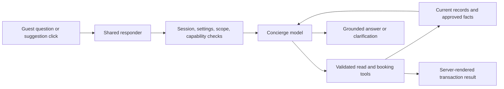

# Retire saved answers and retrieve context per question

Plan: 2026-10-01. Implementation: 2026-10-03. Scope: retire all saved Q&A and ship question-based context retrieval across web and messaging.

## Decision

Retire the saved Auto Answers and Q&A workflow. Each guest question should reach one concierge that fetches the facts it needs through read tools, then answers in the guest's language. Keep server-controlled booking calculations, confirmation, ownership, takeover, and capability checks.

Keep a small collection of staff-approved business facts for information missing from structured records. Store facts once, with their source and scope; do not maintain question aliases, generate paraphrases, match questions to fixed answers, or save model replies as future knowledge.

The model can decide what to look up. Server code decides what data it may access and whether a transaction is valid. A cheaper model does not make stale context accurate.

## Production cleanup

The user explicitly selected **retire all saved Auto Answers and Q&A**. The inspected production deployment is `wary-toad-189`.

| Data                                                 | Before cleanup                                 | Retirement action                             |
| ---------------------------------------------------- | ---------------------------------------------- | --------------------------------------------- |
| `chatAnswers`                                        | 5 approved records, all titled `[AI-EVAL] ...` | Archive all 5                                 |
| `chatQuestions`                                      | 22 approved linked questions; 5 AI triggers    | Reject all 22 and clear primary/trigger flags |
| `curatedChatQuestions`                               | 16 active records: 2 static and 14 dynamic     | Archive all 16                                |
| `curatedChatQuestionVariants`                        | 0                                              | No rows to change                             |
| Answer scope/topic links and custom knowledge scopes | 0                                              | No rows to change                             |
| `propertyKnowledge`                                  | 0                                              | No rows to change                             |

These 22 questions were marked `createdBy: admin`, so deleting only rows marked AI-generated would have missed the production contamination. The five evaluation answer bodies include breakfast charges, late checkout benefits, and other policies that were not independently verified in this task; none will be copied into the replacement fact store.

Preserve conversation history, bookings, the 17 unknown-question inbox records, interaction history, and the 29 old per-session suggested-question records. The latter are conversation artifacts, not reusable answers. Current local code no longer generates them in `addAssistantMessageWithSuggestions` or serves them through `nextForSession`; verify deployed behavior before removing their tables.

Cleanup uses existing deployed admin mutations; it does not deploy source changes or permanently delete records. A private production export and exact original rows are saved outside the repository at `/Users/macbook/.local/share/360-tour/backups/qa-retirement-20261001/`. See [the cleanup verification report](ai-context-retirement-production-cleanup.json) for results.

Archival removed the production data from eligibility. The implementation now disables old readers, authoring, restoration, seeding and queued generation on the server. Legacy schemas and admin archive/export operations remain compatible.

## Audit before refactor

- `convex/chatAi.ts`: web responses try approved exact answers, then curated exact/semantic matching, before concierge generation. General concierge context contains all property summaries and up to 30 approved answers.
- `convex/chatKnowledge.ts`: `getApprovedContext` accepts only a session ID. It selects eligible property/global answers by recency, without using the question. Its scope and read-budget protections already exist and should not be rebuilt unnecessarily.
- `convex/chatSuggestions.ts`: semantic matching makes a separate model request; static matches can return saved text directly. Dynamic matches act as hints for a second request.
- The LINE, Facebook, Instagram, and WhatsApp resolvers duplicate parts of this routing. LINE also has coded quick answers in `src/lib/line/quick-answers.ts`.
- `src/components/chat/useChatSession.ts`: connected suggestion clicks reach the server, while disconnected demo suggestions still use canned answers.
- `AnswerFormDialog.tsx`, `QuestionsView.tsx`, and `SuggestionsPanel.tsx` expose the old authoring/review workflow. Creating an answer from an unknown question can generate variants.
- `convex/seed.ts` can recreate the curated bank. Scheduled `generateSuggestedVariants` and `storeSuggestedQuestions` need retirement guards, not just hidden buttons.

These are local source findings. Production function metadata confirms that the cleanup mutations and query entry points exist, but does not establish complete source parity.

At cleanup time, production used GLM overrides. A separate model-routing rollout already changed production to Luna/Sol; see [model routing](ai-model-routing.md). This refactor preserves those existing working-tree changes and provider compatibility, so deploying retirement does not lose support for the configured complex model. It does not change production model environment settings.

## Target flow



The shared responder owns answer generation and retrieval. Channel adapters keep webhook verification, event deduplication, channel booking permissions, delivery, and delivery status. This avoids changing transaction semantics while removing duplicated question-bank routing.

### Always present

Include a compact business profile from effective settings, resort date/timezone, allowed capabilities, guest language, active property identity, recent conversation, and current booking proposal/state. If needed, include a compact property directory of IDs/slugs and names so the model can select records without guessing names. Do not preload all property details, services, and approved prose.

Use structured current settings for check-in/out, cancellation policy, contact, currency, and other supported profile fields. Defaults must be identified as demo defaults where applicable; absence of an owner-approved policy must not be filled from retired fixtures. Put creator/demo identity in a maintained profile field or approved fact before relying on it in replies.

### Fetch on demand

Reuse existing tools for property details, catalog, quotes, availability, booking preparation/confirmation, cancellation, and owned booking status. Remove hardcoded villa lists from tool descriptions where they can become stale.

Add one read-only tool:

```ts
search_business_facts({ query: string, propertySlug?: string })
// Returns bounded approved facts with factId, title, body, scope,
// revision, updatedAt, and source reference; plus an explicit no-match result.
```

The server derives session/channel authorization and validates the property slug against current records. Explicitly named properties take precedence over the page being viewed. Ask which property/service the guest means when ambiguity affects the answer; never mix incompatible property policies. Do not accept a model-supplied user ID or use this search to expose private booking data.

For “Is breakfast included?”, search approved breakfast facts. For “How much for three nights?”, call the price tool. For “Is it available next weekend?”, resolve exact resort-local dates and call availability. For “Does that villa allow dogs?” after a villa discussion, resolve the referenced villa before searching its pet policy. No old Q&A matching is involved.

### Facts and search

Start with a new `businessFacts` table: title, body, canonical search text/keywords, optional real property ID, approved/draft/archived status, revision, source reference, and admin authorship/timestamps. Absence of a property ID means global. This initially supports global or one real property per fact; custom/multiple scopes require an explicit later design rather than silently treating them as global.

Add a search index with status and property ID as filter fields. Search the requested property and global facts separately, with bounded reads, then apply specific-over-global precedence and return a compact result. Start with at most 6 facts and 8,000 evidence characters total, with input length/read budgets. These are initial limits to validate, not measured optima. A conflict should prompt clarification or staff review, not an invented reconciliation.

Convex full-text search uses whitespace/punctuation tokenization and works best with Latin-script languages. Have the concierge supply canonical English search terms for TH/KO questions in the same tool call; maintain corresponding approved search text on facts. Test Thai, Korean, synonyms, and follow-up questions explicitly. If recall fails the release gate, add multilingual embeddings over approved facts and combine semantic and lexical retrieval before release. Do not assume raw Thai keyword search is sufficient. [Convex full-text search documentation](https://docs.convex.dev/search/text-search).

Search results are evidence, not instructions. Settings/current tools outrank prose for changing facts. Past assistant messages supply conversational references, not authoritative business facts: revalidate claims against current sources so retired answers in old chat history cannot become evidence. Missing facts produce an honest response and an unknown-question/staff-review record. Model output, retrieved instructions, old transcripts, and eval fixtures never publish facts automatically.

## Implementation sequence

1. **Disable retirement writers and readers.** Use one permanent server retirement guard (`lib/legacyQa.ts`); the user authorized complete retirement, so no runtime switch can re-enable saved answers. Check it inside legacy create/update/restore/link/generation/seed endpoints and scheduled worker mutations. Disable `resolveExact`, curated exact/semantic routing, question-bank hints, and approved-answer prompt injection. Guard workers that were queued before retirement. Keep archive/export and private rollback capabilities available. Do not hide the UI while leaving callable writers active.
2. **Add authoritative fact retrieval.** Add the optional fact storage/indexes, staff fact editor, and search tool. Reuse settings/catalog/booking reads. Seed no retired answers; populate only independently verified facts. Test that an empty fact store leads to supported live answers or honest missing-context responses.
3. **Use one responder across channels.** Route web and the four messaging channels through it. Preserve channel-specific permissions, guardrails, rate limits, server write guards, and delivery behavior. Drop the semantic matching request. Allow tool rounds when needed; this is one concierge orchestration, not a promise of one HTTP model request per turn.
4. **Replace admin authoring.** Replace Auto Answers/Q&A/variant review with Business facts and Missing information. Staff can add/edit/approve facts and resolve missing-information reports by linking a fact or structured source. Preserve staff handoff. Legacy records are read-only archives and cannot be restored into the new retrieval path.
5. **Simplify guest suggestions and fallbacks.** Keep useful question-only chips; clicking sends ordinary question text through the same responder. Remove fixed answers and question matching from the chip data. Convert LINE fact postbacks to normal questions; greeting/menu presentation may remain. Audit every coded fallback and translated preset so deleted policy claims cannot reappear when AI is unavailable or the client is disconnected.
6. **Deploy and evaluate.** Ship backend compatibility first, then channel/UI callers. Control fact search with `AI_FACT_RETRIEVAL_PERCENT` (0–100, default 100), a deterministic session cohort. Set 0 to roll back fact lookup while retaining current structured tools and honest unknown responses. Legacy authoring remains disabled even if retrieval is rolled back. Track cost, latency, retrieval sources, and unknowns; expand after correctness gates pass.
7. **Remove the legacy schema later.** Keep deprecated tables/fields while old callers or original rows remain. Inventory references in sessions, unknown records, interactions, variants, scopes, and topics. After the observation window, use the existing migrations component for resumable batched removal, then remove compatible code/schema. Do not hard-delete parent rows ahead of dependent references or revive archived data during a backfill. [Convex migrations component](https://github.com/get-convex/migrations).

Implement steps 1–2 together for the first deploy, so disabling answer paths has a useful replacement. If it must be split, a temporarily empty fact store is preferable to using the retired test data.

## Verification and release gates

- Freeze a labeled set covering property details, settings, quotes, availability, approved policies, unknown policies, and follow-up references in EN/TH/KO. Include explicit other-property questions while browsing a different villa, multi-topic questions, and ambiguous services.
- Test through the web responder and every messaging reply resolver, not just internal concierge generation. Use controlled test records and mocked external delivery; keep fixtures outside production.
- Assert facts and committed database state deterministically. Changing a policy, price, service, or fact revision must change the next answer; no old matched response may bypass the change.
- Assert archived/unapproved facts cannot be retrieved, global/specific precedence is correct, and other-property/private information does not leak. Test injected instructions inside fact content and stale retired claims in previous assistant messages.
- Confirm there are zero critical factual or transaction errors in the required release cases, zero retired matcher/variant-generation calls, and no reads of archived Q&A as answer context. Measure task success and retrieval recall by language, not just fewer unknown responses.
- Preserve existing consent, proposal snapshot, quote revalidation, idempotency, timeout, booking ownership, pause/takeover, and committed-result tests. Tools remain within the existing 20-second turn deadline, three rounds, and twelve calls unless measured evidence justifies a change. Writes stay sequential and are not blindly retried.
- Record provider usage, model ID, prompt version, tools called, selected fact IDs/revisions, prompt size, stage timing, response status, and missing-context reason. Avoid putting visitor contact data or raw private transcripts in telemetry.
- Compare paired old/new behavior in dev with a labeled fixture corpus and the same model. Initial targets: remove the separate semantic matching call and reduce p95 prompt size; do not worsen required task correctness or channel delivery deadlines. Report measured latency and cost before claiming improvements.
- Production cleanup verification is read-only: row statuses, empty approved context, and representative old exact matches returning no result. It is not an end-to-end model or external channel delivery test.

## Recovery and completion

The private manifest contains exact original rows and operation results. For accidental archival of verified information, inspect selected IDs in the private export and re-enter independently verified facts with their sources. The retired public status/approval APIs cannot restore Q&A. A historical data restoration would require a separately reviewed internal migration. Do not import the entire backup over current production, which could overwrite newer conversations or bookings. Archived test answers are excluded from normal retrieval rollback.

Feature retirement is complete when all channels use the shared responder, business facts have replaced Q&A authoring, legacy generation/restoration cannot repopulate the old system, suggestions contain no fixed answers, and the release gates pass. Permanent row/table deletion is a later housekeeping step after compatibility and retention checks.

## Implementation evidence and remaining operations

The core refactor implements steps 1–5 and rollout controls from step 6. `businessFacts` is additive; no legacy row/table is deleted or imported into it. Admins maintain sourced facts and link missing-information reports directly. All four messaging adapters share one resolver; web uses the same concierge. Current property details, services, quotes and availability are tool reads. Empty knowledge falls back honestly.

Structured `concierge_context` logs include prompt version, channel, model, initial prompt characters, elapsed time, tool names, selected fact IDs/revisions and provider token/cost fields when supplied. They exclude raw queries, evidence bodies, transcripts and guest contacts. Eval helpers retain detailed traces for controlled test sessions. This is instrumentation, not a claim of measured savings or production accuracy.

Verification includes retained booking/consent/ownership/pause/idempotency/price-change tests; new indexed fact retrieval and retired-writer tests; mocked EN/TH/KO tool rounds; all four messaging resolvers; and a real development admin draft-create flow. Obsolete publishing/matcher success tests are replaced by retirement invariants; archive cascade and inbox tests remain.

Production monitoring, larger labeled live-model recall evaluation, paired p95 latency/cost measurements and the later schema removal remain operational follow-ups. Embeddings are intentionally deferred until measured lexical recall requires them. Do not claim those experiments or real external channel delivery have passed. The production cleanup report is historical evidence, separate from this source deployment.
